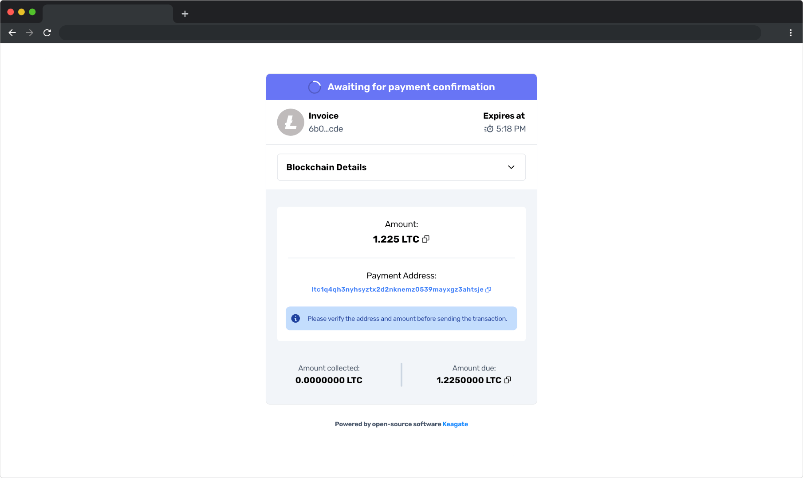

<!-- markdownlint-disable MD033 MD041 -->

<br />

<!-- http://ipa-reader.xyz/?text=ki%3Age%C9%AAt&voice=Joey --->

<h2 align="center">

Keagate *(&#107;&#105;&colon;&#103;&#101;&#618;&#116;)* – A High-Performance Cryptocurrency Payment Gateway

</h2>
<!--
<h4 align="center">
  <b>🚧 This project is actively in development 🚧</b>
</h4>
--->

<h4 align="center">
    
    
    
    <a target="_blank" href="https://gitter.im/Keagate/community?utm_source=share-link&utm_medium=link&utm_campaign=share-link"></a>
    <a target="_blank" href="https://dilan-dio4.github.io/keagate-example-swagger/"></a>
</h4>

<br />
<!-- TODO: Keagate Vector --->

<!-- TABLE OF CONTENTS -->
## Table of Contents

* [About the Project](#about-the-project)
  * [Purpose](#purpose)
* [Installation](#installation)
  * [One-liner](#one-liner)
  * [Manual](#manual-installation)
* [Configuration](#configuration)
  * [CLI](#cli)
  * [Custom](#custom)
* [Instant Payment Notifications](#instant-payment-notifications)
* [Development](#development)
  * [Adding an API route](#adding-an-api-route)
  * [Customizing the invoice interface](#customizing-the-invoice-interface)

## About The Project

Keagate is a self-hosted, high-performance cryptocurrency payment gateway. Payments can be administered [via API](https://dilan-dio4.github.io/keagate-example-swagger/) for flexibility or with the built-in invoicing client (*image below*).

**Supported currencies: Bitcoin, Ethereum, Dogecoin, Solana, Litecoin, Polygon, Dash,** *Ripple (coming soon), Tron (coming soon)*.

<p align="left">
  
</p>

### Purpose

* No KYC
* No fees, middleman, or escrow
* Self-hosted/Private
* Easily extensible
* Lightweight and highly performant

Funds go directly to your wallet via a one-time address that is generated for each payment.

## Installation

### One-liner

The purpose of this installation script is to get Keagate up-and-running quickly in a Linux environment. The CLI will guide you in configuring, managing, and securing the instance.

```bash
bash -c "$(curl -sSL https://raw.githubusercontent.com/dilan-dio4/Keagate/main/packages/scripts/keagate.sh)"
```

*Alternate*:

```bash
curl -o keagate.sh https://raw.githubusercontent.com/dilan-dio4/Keagate/main/packages/scripts/keagate.sh
chmod +x keagate.sh
./keagate.sh
```

This helper script has been tested on...

* Ubuntu 18+
* Debian 10+
* Amazon Linux 4.14+
* CentOS 7.9+

...via AWS and Azure.

<!-- No Docker quick install on Redhat RHEL -->

This script should run successfully on most flavors of Linux with some configuration. Otherwise, use the manual build, as it's fairly straightforward.

### Manual Installation

#### Prerequisites

* MongoDB – [Install](https://www.mongodb.com/docs/manual/installation/)
  * Running on your machine **OR** remotely via a connection string
* Web server (like Nginx or Apache2) – [Install](https://docs.nginx.com/nginx/admin-guide/web-server/reverse-proxy/)
  * Serving as a reverse proxy to `localhost:8081`
  * `8081` is the default port that Keagate runs on, can be changed via the [*PORT* configuration option](#custom).
* Node > 14 and NPM – [Install](https://github.com/nvm-sh/nvm#installing-and-updating)
  * Use of `nvm` to manage Node and NPM is recommended

```bash
# +++ Don't have Node?
curl -o- https://raw.githubusercontent.com/nvm-sh/nvm/v0.39.1/install.sh | bash
nvm install 16
nvm use 16
# ---

npm i -g pnpm
pnpm setup
pnpm -g pm2

git clone https://github.com/dilan-dio4/Keagate
cd Keagate
pnpm i
pnpm run build

# +++ Configure Keagate with:
node packages/scripts/build/configure.js
# --- OR manually (see Configuration section)

pm2 start packages/backend/build/index.js --name Keagate --time
```

## Configuration

Keagate requires some configuration. This is done via a file called `local.json` in `/config`, next to `default.json`. This file will automatically be used when you start Keagate. *Note that parameters in `local.json` will overwrite those in `default.json`*.

There are **two** methods to configure Keagate, and they can be used in conjunction with each other.

### CLI

Keagate has a built-in CLI to build configurations in [packages/scripts](packages/scripts/src/configure.ts). After you've cloned and built the package. Head to the root *Keagate* directory and execute the following:

```bash
node packages/scripts/build/configure.js
```

*Note – this CLI is automatically launched in the one-liner installation script.*

The CLI will write the `config/local.json` file upon completion unless one already exists. In that case, it will write to `config/local2.json` and ask that you manually merge your new parameters, as needed.

### Custom

Create or open the file `local.json` in `/config`. You can use the provided `default.json` file as a reference **(your `local.json` will override these)**.

*The schema of the Keagate configuration can be seen (in TypeScript) at [packages/common/src/config.ts](packages/common/src/config.ts).*

#### Currencies

To configure a single currency, add an object with the key of the currency's ticker with the following attributes:

Ticker can be one of `'LTC', 'BTC', 'ETH', 'DOGE', 'SOL', or 'MATIC'`. [See example](#example).

| Key                              | Description                    | Required | Default |
|----------------------------------|----------------------------|----------------------------------|--|
| `ADMIN_PUBLIC_KEY`          | Public key (address) of your admin wallet    | **Yes** | *null* (string) |
| `ADMIN_PRIVATE_KEY`         | Private key of admin wallet. Only needed if you plan on programmatically sending transactions  | No | *null* (string) |

#### Protected options

This section details specific configuration parameters that should be handled with extra care. A malicious actor could manipulate the integrity of payments if they had access to these parameters.

**There's a built-in script to securely generate and print these values at random:**

```bash
node packages/scripts/build/setupSeeds.js
# OR
ts-node packages/scripts/src/setupSeeds.ts

# Prints
{
  "INVOICE_ENC_KEY": "5036...9cc3",
  "SEED": "eb08...3afc",
  "KEAGATE_API_KEY": "9fac8f7d...c6568f97",
  "IPN_HMAC_SECRET": "e50dd645...ea5baf54"
}
```

| Key                              | Description                    | Required | Default |
|----------------------------------|----------------------------|----------------------------------|--|
| `SEED`         | Seed for transactional wallet generator. Must be a 128-bit hex string. **Protect this value in production** | **Yes** | *null* (string) |
| `KEAGATE_API_KEY`         | Api key that will be required in administrative request's `keagate-api-key` header. **Protect this value in production** | No | 'API-KEY' (string) |
| `INVOICE_ENC_KEY`         | Key that will be used to encrypt payment IDs when distributed via invoice. **Protect this value in production** | **Yes** | *null* (string) |
| `IPN_HMAC_SECRET`         | Key of the HMAC signature that is set in the `x-keagate-sig` header of each POST request when using [Instant Payment Notifications](#instant-payment-notifications). **Protect this value in production** | No | *null* (string) |

#### Other options

| Key                              | Description                    | Required | Default |
|----------------------------------|----------------------------|----------------------------------|--|
| `IP_WHITELIST`         | List of IP address ["1.1.1.1" , "2.2.2.2",...] to be whitelisted for administrative requests | No | [] (string[]) |
| `TRANSACTION_TIMEOUT` | Milliseconds by which payments will be valid for. After that, the payment is expired | No | 1200000 [20 Minutes] (number) |
| `TRANSACTION_MIN_REFRESH_TIME` | Minimum milliseconds by which transactions will idle between refreshes | No | 30000 [30 Seconds] (number) |
| `TRANSACTION_SLIPPAGE_TOLERANCE` | Percentage of a total payment that is discounted as slippage.<br /><br />Example: a TRANSACTION_SLIPPAGE_TOLERANCE of 0.02 for a 100 SOL payment will be fulfilled at 98 SOL. | No | 0.02 (number) |
| `BLOCKBOOK_RETRY_DELAY` | Milliseconds to wait before re-trying a failed Blockbook request. | No | 5000 (number) |
| `MONGO_CONNECTION_STRING` | Connection string for MongoDB instance including any authentication. | No | 'mongodb://localhost:27017' (string) |
| `MONGO_KEAGATE_DB` | Mongo database to use for storing/managing payments | No | 'keagate' (string) |
| `IS_DEV` | **For development only**. Turn on testnets for given currencies and activate development features | No | false (boolean) |
| `HOST` | Your domain or IP that Keagate is running on. **This is used for aesthetics and has no functional effect on Keagate** | No | *null* (string) |
| `PORT` | The port that Keagate's backend API will run on | No | 8081 (number) |

<!-- | `USE_SO_CHAIN` | [SoChain](https://sochain.com/api/#introduction) is a free blockchain infrastructure API for that allows for 300 requests/minute free-of-charge.<br /><br />Setting this to `true` will utilize SoChain for part of the btc, dash, and ltc payment process. **Recommended** | No | true (boolean) | -->

#### Example

Your `config/local.json` could look something like:

```js
{
  "LTC": {
    "ADMIN_PUBLIC_KEY": "MY_WALLET_ADDRESS",
    "ADMIN_PRIVATE_KEY": "MY_PRIVATE_KEY"
  },

  "KEAGATE_API_KEY": "abcd123",
  "IP_WHITELIST": ["1.1.1.1","2.2.2.2"]
  // ...
}
```

## Instant Payment Notifications

To be notified of payment updates in real-time, use instant payment notifications (IPN).

### Use IPNs

1. Make sure you have configured the *IPN_HMAC_SECRET* attribute in [Configuration](#protected-options). This will allow you to guarantee the origin and trust the integrity of incoming messages.
2. Have access to some API or serverless function that can be invoked publicly via URL.
3. Pass this url into the `ipnCallbackUrl` attribute of your [*createPayment*](https://dilan-dio4.github.io/keagate-example-swagger/#/Payment/post_createPayment) requests.

Just like that, IPNs are all setup on Keagate. A POST request will be sent to the `ipnCallbackUrl` with a JSON object like that of [*TypeForRequest*](https://dilan-dio4.github.io/keagate-example-swagger/#model-def-0).

The last thing you should do before using these notifications is validate all incoming messages via HMAC.

### Validate IPN Messages

The previously configured *IPN_HMAC_SECRET* is used as a key in the sha-512 HMAC signature generated for the `x-keagate-sig` header of each notification.

*Note: be sure to sort the request body alphabetically before generating your HMAC.*

Here's a NodeJS example of validating this header in Express.

```js
var crypto = require('crypto')
var express = require('express')

const app = express()
app.use(express.json())

app.post('/ipnCallback', (req, res) => {
  // +++ Generate my signature
  const hmac = crypto.createHmac('sha512', IPN_HMAC_SECRET);
  hmac.update(JSON.stringify(req.body, Object.keys(req.body).sort()));
  const signature = hmac.digest('hex');
  // ---

  if (signature === req.headers['x-keagate-sig']) {
    // Good to go!
  } else {
    // This notification may be spoofed...
  }
});
```

## Development

Development experience and extensibility are the utmost priority of this package.

To get started:

1. Clone this repo.
2. Install `pnpm` globally with `npm i -g pnpm`
3. `cd Keagate && pnpm i`
4. Add a MongoDB connection to the `MONGO_CONNECTION_STRING` attribute in `config/local.json`, along with some admin wallet credentials and the other [required configuration parameters](#custom). For development, the [Mongo Atlas free tier](https://www.mongodb.com/cloud/atlas/signup) works great.
5. `pnpm run dev` to start the invoice client and backend.
    * Any changes in `packages/invoice-client/src` will be automatically reflected on refresh.
    * Any changes to the source of `packages/backend/src` will be reflected automatically via `ts-node-dev`.
    * Any changes to `config/local.json` have to be manually refreshed.
6. The backend will run at `127.0.0.1:8081`. See your API docs at `http://127.0.0.1/docs`.

<details>

<summary>

### Adding an API route

</summary>

Keagate follows the [Fastify plugin pattern](https://www.fastify.io/docs/latest/Reference/Plugins/). Place your route in [`packages/backend/src/routes`](packages/backend/src/routes). The `default export` of the file should be a function that takes a *Fastify* instance as a parameter. In that function, add your route to the provided *Fastify* instance. **Be sure to add a schema to your route via the `RouteShorthandOptions` type exported from Fastify. Schemas should be built with [TypeBox](https://github.com/sinclairzx81/typebox).

The schemas will appear in your Swagger docs for a unified developer experience.

Finally, in [`packages/backend/src/index.ts`](packages/backend/src/index.ts), register your new route like so:

```ts
import createPaymentStatusRoute from './routes/paymentStatus';
import createPaymentsByExtraIdRoute from './routes/paymentsByExtraId';
import create_YOUR_FUNCTIONALITY_Route from './routes/YOUR_FUNCTIONALITY'; // <--

// ...

server.register(createPaymentStatusRoute);
server.register(createPaymentsByExtraIdRoute);
server.register(create_YOUR_FUNCTIONALITY_Route); // <--
```

Use [`packages/backend/src/routes/activePayments.ts`](packages/backend/src/routes/activePayments.ts) as a reference of an authenticated route.

Use [`packages/backend/src/routes/invoiceStatus.ts`](packages/backend/src/routes/invoiceStatus.ts) as a reference of an unauthenticated route.

</details>
<details>

<summary>

### Customizing the invoice interface

</summary>

The invoice client is a statically built React package (via Vite). This static build is served in `backend`. This functionality can be seen [here](packages/backend/src/routes/invoiceClient.ts).

Editing the react package will automatically build to `packages/invoice-client/dist`, so just refresh the page to see any changes.

The source of `invoice-client`'s React project is pretty straightforward, so those familiar with React (& TailwindCSS) should have an easy time making their desired alterations.

</details>

<!--
<details>

<summary>

### Adding a currency

</summary>

There's four steps in adding a currency to this package.

1. Add the ticker, along with some metadata, to the currencies type in [packages/common/src/currencies.ts](packages/common/src/currencies.ts).
2. Create the admin wallet. This is where payments are finally sent to and presumably the real wallet of the client. Note that the admin wallet can also be used to programmatically send transactions as well.
    * Start by taking a look at [Solana's admin wallet](packages/backend/src/adminWallets/Solana/index.ts) and note that you only need to implement two functions: `getBalance` and `sendTransaction`. The class that admin wallets inherit from, [GenericAdminWallet](packages/backend/src/adminWallets/GenericAdminWallet.ts), handles class inheritance.
3. Create the transactional wallet. This class can be thought of a payment, since a new transactional wallet is created for every payment, along with a new Public Key and Private Key. Transactional wallets, and their associated payment data, are stored in Mongo.
    1. Start by taking a look at [Solana's transactional wallet](packages/backend/src/transactionalWallets/Solana/index.ts) and note that you only need to implement three functions: `fromNew`, `getBalance` and `_cashOut`. The class that transactional wallets inherit from, [GenericTransactionalWallet](packages/backend/src/transactionalWallets/GenericTransactionalWallet.ts), handles the rest.  
4. Add both the transactional and admin wallet classes to [packages/backend/src/currenciesToWallets.ts](packages/backend/src/currenciesToWallets.ts) so it can be referred to by ticker across the project

**And that's it!** Start the dev environment (`pnpm run dev`) and create a new payment of any amount with your new currency.

</details>

<details>

<summary>

### Adding a blockchain API provider

</summary>

The invoice client is a statically built React package (via Vite). This static build is served in `backend`. This functionality can be seen [here](packages/backend/src/routes/invoiceClient.ts).

Editing the react package will automatically build to `dist`, so just refresh the page to see the changes.

The source code in invoice client is pretty straight-forward, so anyone familiar with React (& TailwindCSS) should have an easy time making their desired alterations.

</details>

<details>

<summary>

### API Providers

</summary>

In order to check wallet balances and broadcast transactions, Keagate needs to interact with particular blockchain APIs. There's a variety of providers out there that support different sets of blockchains. This packages bundles up connectors to popular providers with a simple, unified API.

Existing connectors can be seen in the [packages/api-providers](packages/api-providers/src/) folder. All of the one available in this package provide generous free tiers. Simply pass your API keys with the configuration below.

Currently available API providers:

| Name  | Available chains |
|-----------------|--------------|
| NowNodes | dash, ltc, btc |
| Tatum | ltc, btc, ada, and xrp |

It's very easy to add a provider, see [TatumProvider.ts](packages/api-providers/src/TatumProvider.ts) as an example.

Make sure that one of the available API providers cover each currency you plan on using.

</details>

-->
